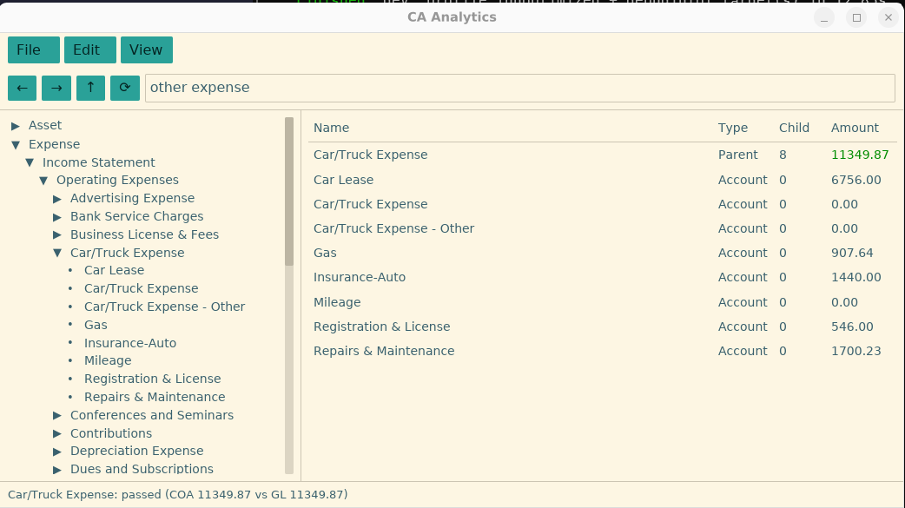
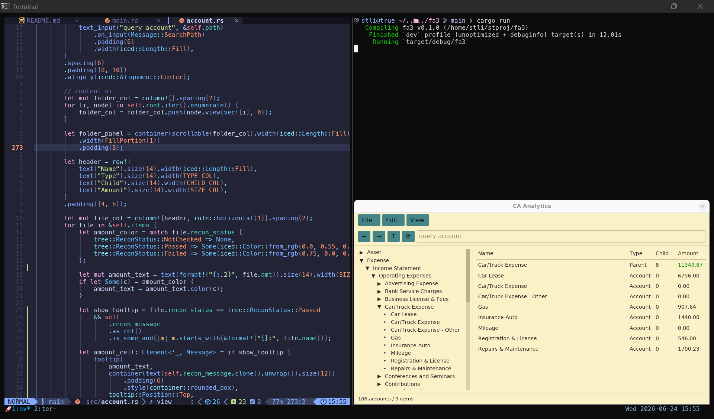

**The App** 
This tool is used for COA reconciliation during financial audit process. 
 
 


**How to use**
```bash
~/duckdb asset/gl.duckdb

```


**Prerequisite**
1. `./asset/coa.csv` is generated out of accounting system in the certain `format`. For instance, account can not be named "100".
2. `./asset/gl.db` stores all supporting sub-ledger files for reconciliation and `recon_status` table for audit trail.
3. `./check/car_truck_expense.csv` requires columns `amount` `account` `subaccount` to recompute and check again COA amount.
4.


**Known issues**
1. winit/WSL window::resize_events() - iced apps on WSL2's Wayland compositor hit broken-pipe IO errors, eventually losing the Wayland socket entirely, and separately WSLg's Weston compositor doesn't fully support native window-management features like resize/maximize. 
WSLg also runs an XWayland server alongside Weston. `WAYLAND_DISPLAY= DISPLAY=:0 cargo run` force winit's platform detection falls back to X11 via XWayland.
2. window size - triggering the above issue as well. a larger surface means a bigger shared-memory buffer has to cross the Wayland socket between winit and Weston inside WSLg.
3. 
